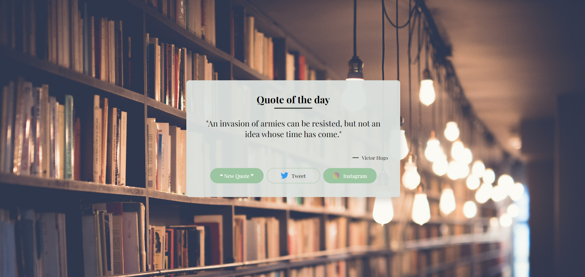

# Inspire Sire

## Table of Contents

* [About The Project](#about-the-project)
* [Languages](#languages)
* [Features](#features)
* [Usage](#usage)
* [License](#license)  

## About The Project

Inspire-Sire is a random quote generation project that will let you tweet directly to your page. We are currently attempting to add support for Instagram story posting. **Future development for facebook status direct** 

## Languages

* 
* 
* 

## Features

* **New Quote button:** allows continuous generation of new quotes.
* **Tweet button:** calls separate window pop-up that allows direct twitter posting.
* **Instagram Button:** currently developing, only allows linking to instagram currently.
* **API Integration:** integrated with API for continuous quote pulling 

## Usage

* [Website Link](https://ivionsters.github.io/Inspire-Sire/)

* [Github Repo](https://github.com/IVIonsters/Inspire-Sire)

* 

## License

